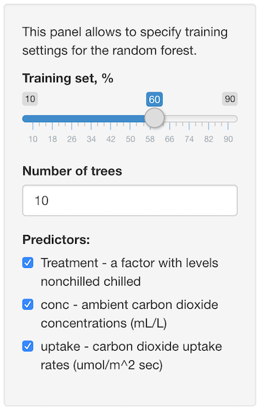
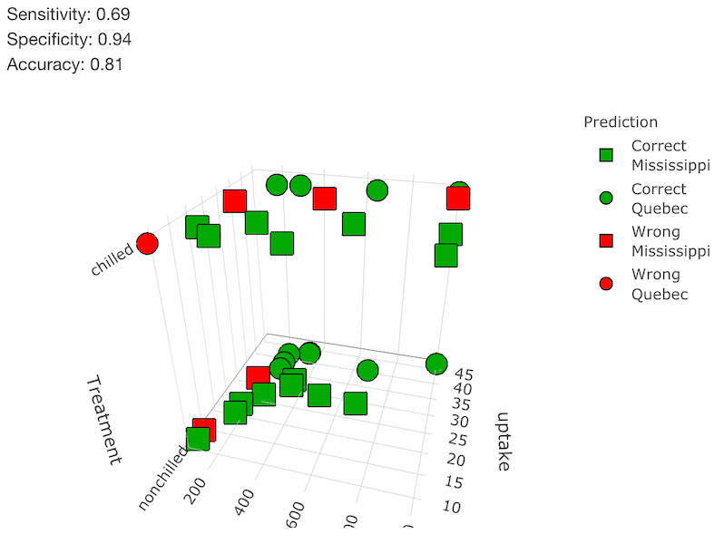

Carbon Dioxide Uptake in Grass Plants
========================================================
author: Andrey Yegorov
date: 10/23/2020
autosize: true

Idea
========================================================

We would like to identify origin of the grass species Echinochloa crus-galli 
(`Quebec` or `Mississippi`)
based on the cold tolerance (`Treatment`), carbon dioxide uptake rates (`uptake`) 
and ambient carbon dioxide concentrations (`conc`).

```r
library(datasets)
data(CO2)
rbind(head(CO2, 3), tail(CO2, 3))
```

```
   Plant        Type  Treatment conc uptake
1    Qn1      Quebec nonchilled   95   16.0
2    Qn1      Quebec nonchilled  175   30.4
3    Qn1      Quebec nonchilled  250   34.8
82   Mc3 Mississippi    chilled  500   17.9
83   Mc3 Mississippi    chilled  675   18.9
84   Mc3 Mississippi    chilled 1000   19.9
```

Prediction algorithm
========================================================

Random forest was used to predict type of origin - `Quebec` or `Mississippi` - 
based on combinations of the following variables:
 1. `Treatment` - if plant was chilled overnight before the experiment or not
 2. `conc` - Ambient carbon dioxide concentrations (mL/L)
 3. `uptake` - Carbon dioxide uptake rates (umol/m^2 sec)

Application - Settings Panel
========================================================



***

Sidebar panel allows to specify input parameters to train random forest.
 - Size of the training set can be specified while the remaining data will form 
testing set.
 - Number of the trees in the random forest to classify observations.
 - Variables used in the random forest (`Treatment`, 
`conc` and `uptake`).

Application - Output Panel
========================================================

Main panel allows to view predictions of the trained random forest on the 
testing set.  

3D plot shows predictions for the testing data:
 - color shows if prediction was correct (green) or wrong (red)
 - shape shows if real origin was `Mississippi` (square) or `Quebec` (circle)

***


